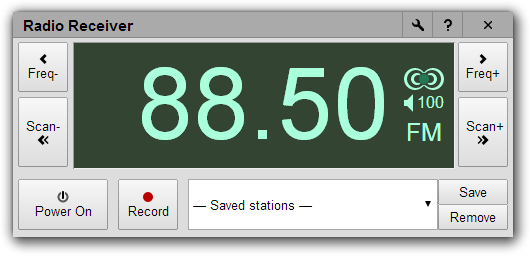

# Radio Receiver

An application to listen to broadcast FM and AM radio from your Chrome browser or your ChromeBook computer using a $15 USB digital TV tuner.

## What is this

Radio Receiver is a Chrome application that uses an USB digital TV receiver to capture radio signals, does FM and AM demodulation in the browser, and plays them through your computer's speakers or headphones. This is called SDR (Software-Defined Radio), because all the radio signal processing is done by software running in the computer.

Radio Receiver is 100% written in JavaScript, but is nevertheless fast enough that it can run on a 2012 Samsung ChromeBook laptop at full quality.

## Features

* Stereo FM.
* Scan for stations.
* Record what you hear on the radio.
* Built-in bands:
  * International and Japanese FM bands.
  * Weather band (US and Canada).
  * Medium Wave AM (requires an upconverter).
* Free-tuning mode to use the program as a multi-band radio and listen to anything: short wave, air band, marine band, etc.
* Supported modes: Wideband FM, Narrowband FM, AM, SSB.

## Compatible hardware and software

Radio Receiver was written to work with an RTL-2832U-based DVB-T (European digital TV) USB receiver, with a R820T tuner chip. You can easily buy one for $15 or less by searching for [RTL2832U R820T] on your favorite online store or web search engine.

You can use this application on a ChromeBook, or on any other computer running a Chrome browser. Just [install it using the Chrome Web Store](https://chrome.google.com/webstore/detail/radio-receiver/miieomcelenidlleokajkghmifldohpo) or any other mechanism, plug in your USB dongle, and click on the icon to start the Radio Receiver application.

To listen to Medium Wave and Short Wave radio, you need an upconverter connected between your antenna and the USB dongle. This upconverter shifts the signals up in frequency so that they can be tuned by your dongle. You can find upconverters for sale by searching for [SDR upconverter] on your favorite online store or web search engine.

## Support

If you'd like to talk about Radio Receiver, or have any bug reports or suggestions, please post a message in [the radioreceiver Google Group](https://groups.google.com/forum/#!forum/radioreceiver).

Note: This is not an official Google product (experimental or otherwise), it is just code that happens to be owned by Google.

## Acknowledgements

Kudos and thanks to the [RTL-SDR project](http://sdr.osmocom.org/trac/wiki/rtl-sdr) for figuring out the magic numbers needed to drive the USB tuner.

If you want to experiment further with Software-Defined Radio and listen to more things using your $15 tuner, you can try [the various programs listed on rtl-sdr.com](http://www.rtl-sdr.com/big-list-rtl-sdr-supported-software/).
